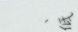
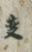
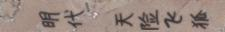
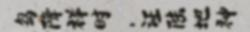
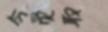
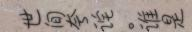
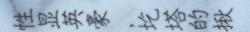

## 文化传承—汉字书法多场景识别(Cultural Inheritance – Recognizing Chinese Calligraphy in Multiple Scenarios)-Baseline

[Competition URL](https://www.datafountain.cn/competitions/334/details)

使用[East](http://link.zhihu.com/?target=https%3A//arxiv.org/pdf/1704.03155.pdf)定位，[crnn](https://arxiv.org/abs/1507.05717)识别文字

## East

参考[AdvancedEASR](https://github.com/huoyijie/AdvancedEAST)

## CRNN

pytorch模型在训练的过程中发现不收敛，且无法本地调试，遂修改为keras版本模型，但由于keras后端使用tensorflow，输入的图片的大小必须一致，不可以动态调整，所以采用了一个比较折中的办法，把图片设置的较大，使用
```angular2html
    img = np.pad(img, ((0, 0), (l, r), (0, 0)), 'constant',constant_values=(0,0))
```

train了两天的效果


['，', '相', '从', '孝', '王', '台', '。', '细', '雨']


['、', '低']


['变']


['告', '，', '灌', '预', '彦', '兼', '，', '票', '脚', '冷']


['明', '代', '天', '险', '飞', '藤']


['岛', '降', '祥', '时', '，', '证', '陆', '地', '种']


['令', '贾', '取']


['武']


['京', '成']


['世', '间', '李', '论', '。', '准', '星']


['承', '公', '＊', '烟', '、', '自', '属', '、', '、']


['西', '“', '添', '瑞', '鲜', '酸']


['性', '显', '英', '豪', '，', '挖', '塔', '的', '搬']
